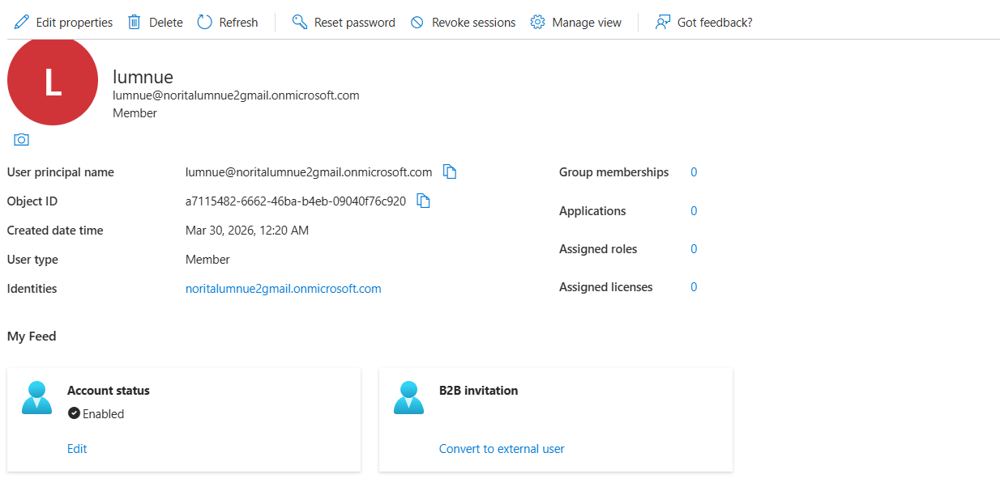
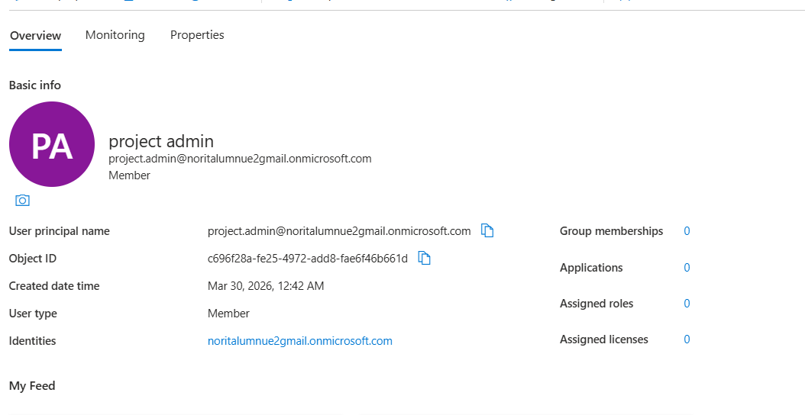
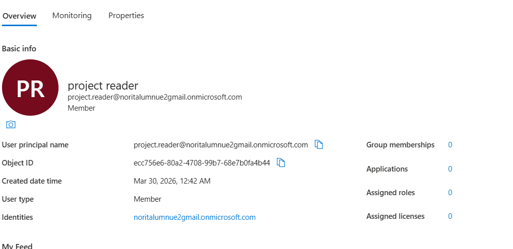
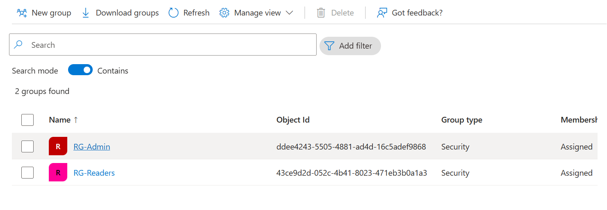
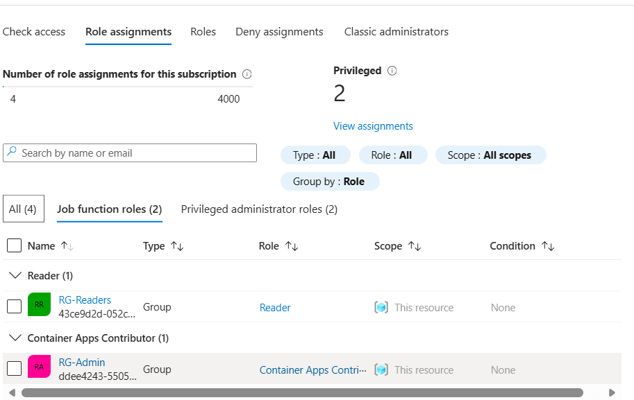
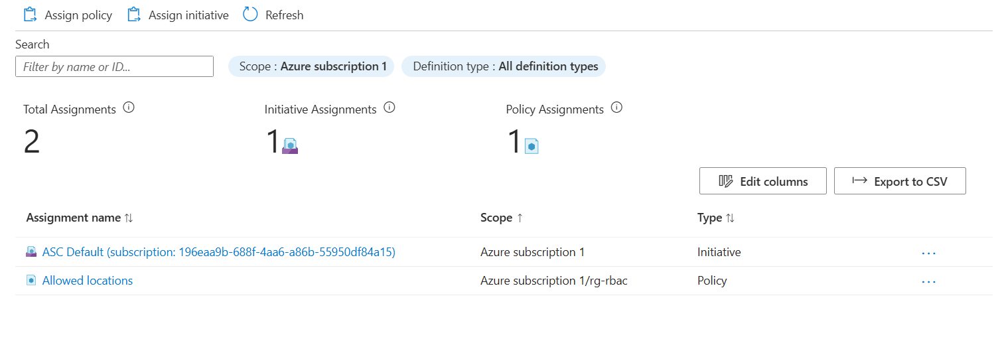
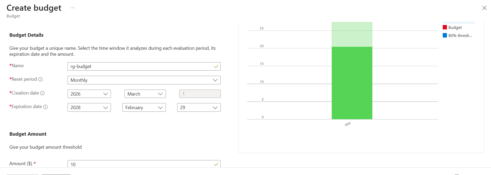
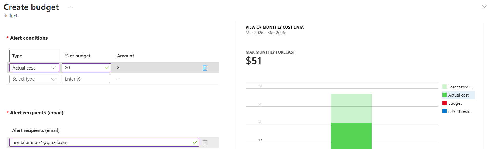

# Azure RBAC, Policy & Cost Management Project
## Overview
This project demonstrates how to implement Role‑Based Access Control (RBAC), Azure Policy, and Cost Management Budgets in Microsoft Azure.
It simulates a real‑world scenario where:
- Different users receive different access levels
- Access is managed through security groups
- Resource deployments are restricted to approved regions
- Spending is controlled through budgets and alerts

These capabilities are essential for Cloud Administrators, Azure Support Engineers, and anyone working with Azure governance and compliance.

## Architecture

Azure RBAC, Policy & Cost Management Architecture

+---------------------------------------------------------------+
|                     Microsoft Entra ID                        |
|---------------------------------------------------------------|
|   Users:                                                      |
|     • project.admin                                           |
|     • project.reader                                          |
|                                                               |
|   Groups:                                                     |
|     • RG-Admins (Contributor)                                 |
|     • RG-Readers (Reader)                                     |
+---------------------------------------------------------------+

                 | RBAC Assignments
                 v

+---------------------------------------------------------------+
|                        Resource Group                         |
|---------------------------------------------------------------|
|   Role Assignments:                                           |
|     • Contributor → RG-Admins                                 |
|     • Reader → RG-Readers                                     |
|                                                               |
|   Policy Assignment:                                          |
|     • Allowed Locations → West Europe                         |
|                                                               |
|   Cost Management:                                            |
|     • Budget: 10 CHF                                          |
|     • Alert at 80%                                            |
+---------------------------------------------------------------+

## A. Create Users
### Steps
Microsoft Entra ID → Users

+ New user → Create new user

## Create:

project.admin@<tenant>.onmicrosoft.com

project.reader@<tenant>.onmicrosoft.com

## B. Create Groups
### Steps
Entra ID → Groups

+ New group

### Create:

RG-Admins (Assigned)

RG-Readers (Assigned)

Add users to groups

## C. Assign RBAC Roles
### Steps
Resource Group → Access control (IAM)

Add role assignment

### Assign:

Contributor → RG-Admins

Reader → RG-Readers

## D. Assign Azure Policy
### Steps
Azure Portal → Policy

Assign policy

Definition: Allowed locations

Allowed: West Europe

## Scope: Resource Group

## E. Create a Budget
### Steps
Cost Management → Budgets

Add

Amount: 10 CHF

Alert threshold: 80%

##  Skills Demonstrated
Microsoft Entra ID (Users & Groups)

Role‑Based Access Control (RBAC)

Group‑based access delegation

Azure Policy (Allowed Locations)

Cost Management & Budget Alerts

Real‑world governance workflows

Documentation & architecture design

##  Conclusion
This project showcases essential Azure administration and governance capabilities.
You implemented RBAC, enforced compliance with Azure Policy, and set up cost controls — all of which are critical skills for cloud engineering roles.

